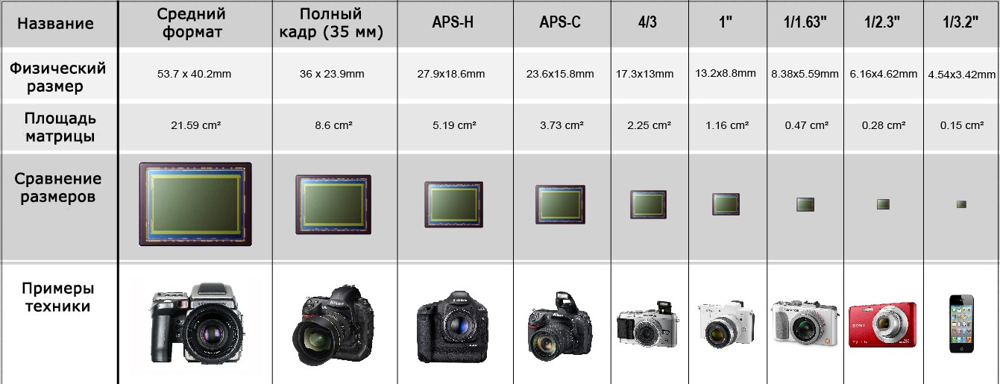
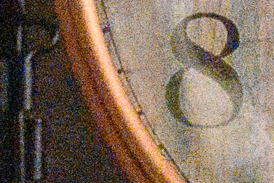
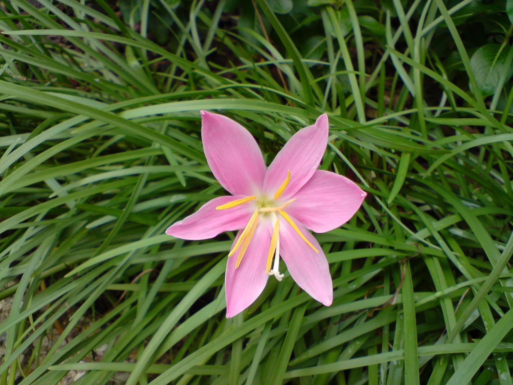
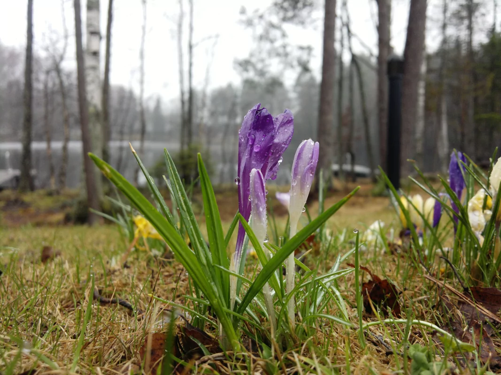
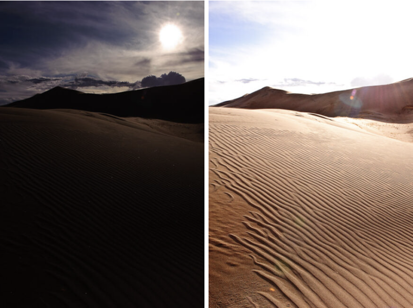
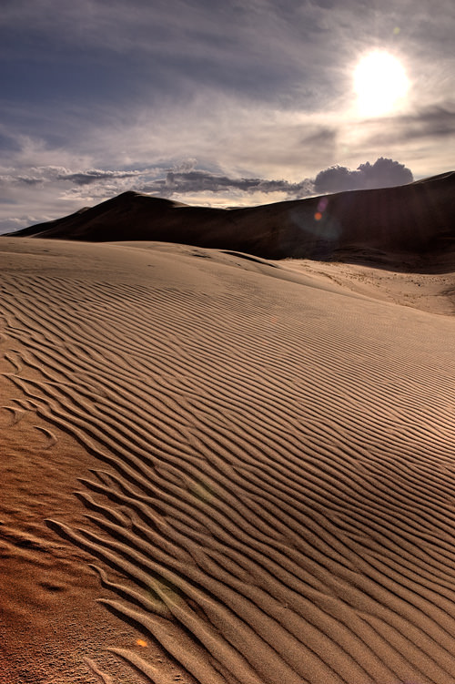
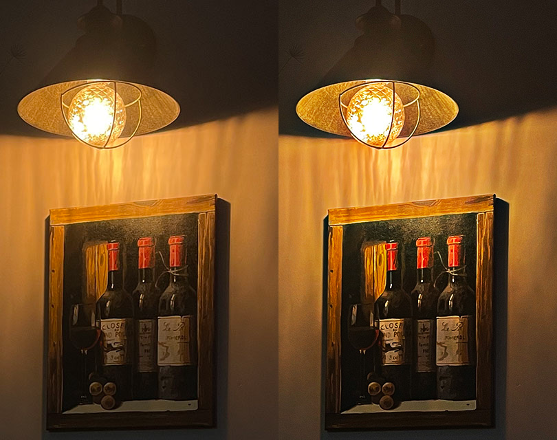
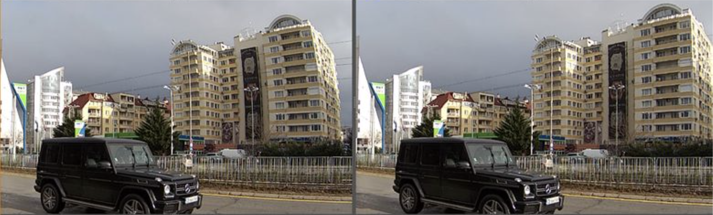

# Фокусы мобильной фотографии

Почему изображения, получаемые на камеры современных смартфонов - это обман?

В данном материале описан путь от нажатия кнопки на экране до сохранения живого, насыщенного и вообще волшебной красоты изображения в галерее. Хотя такое ли оно живое?..
## Техническое отступление
### В чем проблема мобильной съемки?

Посмотрим непосредственно на фотоматрицу - зрачок любого фотоустройства.

На изображении выше продемонстрированы размеры матриц популярных устройств. Площади для полнокадрового фотоаппарата и смартфона разнятся в целых **57 раз**, и флагманские смартфоны сейчас уменьшили этот число до **30 раз**, разрыв все еще значительный.

Именно размер мобильных устройств является основной проблемой мобильной фотографии. 

Попробуем отследить рождение изображения, чтобы разобраться. 

#### Фиксация света
Процесс создания фотографии начинается с записи света матрицей. Матрица имеет свое разрешение - число точек (пикселей), используемых для записи. 

Сейчас их число измеряется миллионами, например, 12 мегапикселей (МП) это примерно 12 миллионов точек, образующих единую картинку. 

При одинаковом разрешении матрицы, размер каждого пикселя в большом фотоаппарате будет многократно больше такового в небольшом телефоне. В маленький пиксель сможет попадать меньше света, а значит, при недостатке освещения, будут появляться шумы - искажения.

## Развитие мобильных камер
Первым полноценным телефоном с камерой принято считать Sharp J-SH04 из 2000 года. Вот так он снимал:

Уже в 2005 Sony Erricson K850i начал делать такие фотографии:

В 2010 Nokia N8 получил заметно больший сенсор:

На этом физическое развитие камер сильно замедлилось. Все вышепреведенные фотографии сделаны в идеальных условиях: отсутствует сильный контраст, достаточное количество света.

### Преимущество телефонов перед фотоаппаратами
Парадокс, но именно возможность использовать телефон не только для фото позволила в значительной степени улучшить качество получаемого изображения. Десяток лет назад активно набирали популярность мобильные игры, требовавшие всё больших вычислительных мощностей.

Устанавливаемые для обработки игровой графики процессоры (системы на чипе, если быть точнее) отлично справлялись с данными камеры, позже к ним присоедились сопровождающие чипы обработки изображения (ISP), используемые только для съемки. Это и задало развитие области до наших дней.

#### Классические средства улучшения
Одними из первых доступных средств обработки изображений в реальном времени были HDR и NR (снижение шума), все дело в их вычислительной простоте
##### Широкий динамический диапазон (HDR)
Человеческий глаз способен захватывать одновременно очень широкий диапазон яркости. Сенсоры камер таким похвастаться не могут. На снимках с ярким солнцем обычно нечитаемы темные участки. 

Чтобы нивелировать подобный момент нужно сделать кадры (минимум два), содержащие информацию из темных и светлых участков, а затем склеить удачные кусочки изображения. 

##### Уменьшение шума (Noise Reduction)
Крохотный размер пикселя, как было описано ранее, заставляет фотографию "шуметь". Самые первые алгоритмы шумоподавления попросту усредняют содержимое соседних пикселей, убирая "зерна" шума. Это приводит к потере деталей, сопоставимой с уровнем зашумленности.

#### Продвинутые алгоритмы
Данные алгоритмы также довольно просты, но требуют больших вычислительных мощностей, чем первая группа

##### Определение границ и краевой контраст
Один из способов увеличить резкость изображения. Повышение контраста на переходах цветов отлично скрывает небольшие замутнения и промахи фокуса. Относится к постобработке.

##### Коррекция оптических искажений
Линзы, особенно широкоугольные, вносят свои геометрические искажения в финальное изображение. Они ломают перспективу, делают картинку нереалистичной. Алгоритмы, ищущие и исправляющие подобные дефекты, обычно настроены под конкретное устройство съемки.

#### Современные методы улучшения

#### Уникальные методики

#### Число пикселей не значит ничего

Маркетологи часто используют уловку с большими числами. Так, в глазах несведующего человека, камера со 108 МП будет выглядеть лучше, чем камера с какими-то жалкими 12 МП. 

Когда мы говорим о смартфонах, разгуляться с размерами сенсора (он же матрица) инженерам не удается. Получается, увеличивая число пикселей, приходится уменьшать их размер, а значит и способность захватывать больше света.

Размеры пикселя принято указывать в µm (микрометры). Давайте сравним популярные устройства:

* Samsung Galaxy S20 Ultra - разрешение **108МП** - пиксель в **0.8µm**
* Google Pixel 4, Apple iPhone 11 - разрешение **12МП** - пиксель в **1.4µm**
* Canon 5D - разрешение **30.1МП** - огромный пиксель в **5.36µm**

Фотоаппарат способен захватить больше света и выдать качественную картинку,

